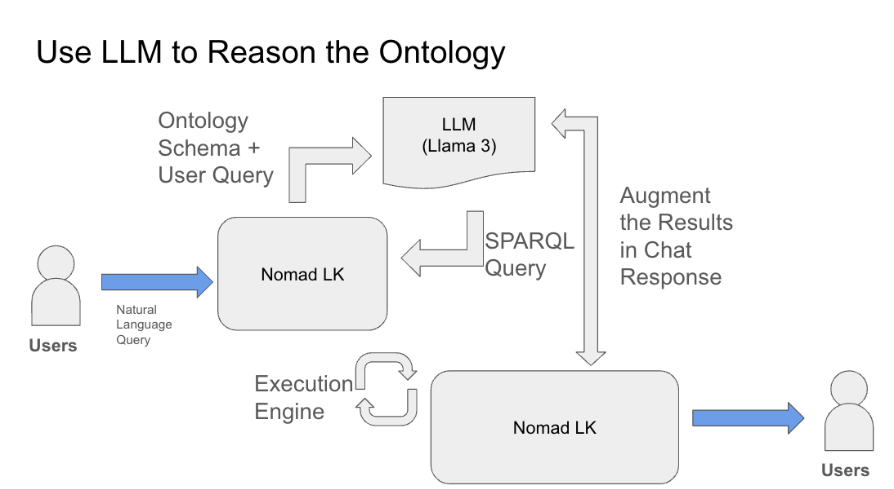

# Nomad LK

Digital Nomad Lifestyle Management Ontology with Reasoning Capabilities Leveraging Large Language Models.
Developed as part of the Semantic Web and Ontological Engineering course, M.Sc. in Artificial Intelligence, University of Moratuwa.

## Architecture



## Run Demo

example .streamlit

```
   GROQ_API_KEY = "YOUR GROQ KEY" 
```

Install Dependancies 

```
    python -m venv env
```

```
    source env/bin/activate
```

```
    pip install -r requirements.txt
```

## Competancy Questions

Question: Which accommodations are located in the city of Galle, along with their cost per night and rating?

PREFIX : <http://www.example.com/digitalnomad#>
PREFIX rdfs: <http://www.w3.org/2000/01/rdf-schema#>
SELECT ?accommodation ?name ?cost ?rating
WHERE {
  :City_Galle :hasAccommodation ?accommodation .
  ?accommodation :hasName ?name ;
                 :hasCostPerNight ?cost ;
                 :hasRating ?rating .
}

Question: What is the cost of living category and its value for the city of Colombo?

PREFIX : <http://www.example.com/digitalnomad#>
PREFIX rdfs: <http://www.w3.org/2000/01/rdf-schema#>
SELECT ?costOfLivingClass ?costValue
WHERE {
  :City_Colombo :hasCostOfLiving ?cost .
  ?cost a ?costOfLivingClass ;
         :hasCostValue ?costValue .
  FILTER(?costOfLivingClass IN (:LowCost, :MediumCost, :HighCost, :VeryLowCost))
}

Question: Which coworking spaces are available in Colombo, and what is their internet speed?

PREFIX : <http://www.example.com/digitalnomad#>
PREFIX rdfs: <http://www.w3.org/2000/01/rdf-schema#>
SELECT ?coworkingSpace ?name ?speedValue
WHERE {
  :City_Colombo :hasCoworkingSpace ?coworkingSpace .
  ?coworkingSpace :hasName ?name ;
                   :offersInternetSpeed ?internetSpeed .
  ?internetSpeed :hasInternetSpeedValue ?speedValue .
}

Question: Which accommodations in Colombo have a rating greater than 4.5 and cost less than 200.00 per night?

SELECT ?accommodation ?name ?rating ?cost
WHERE {
  :City_Colombo :hasAccommodation ?accommodation .
  ?accommodation :hasName ?name ;
                 :hasRating ?rating ;
                 :hasCostPerNight ?cost .
  FILTER(?rating > 4.5 && ?cost < 200.00)
}
